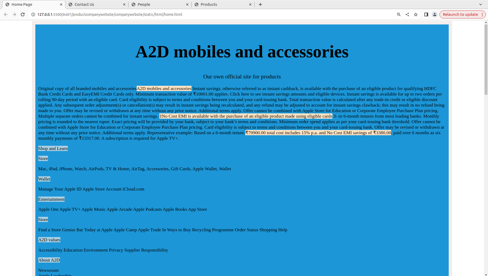
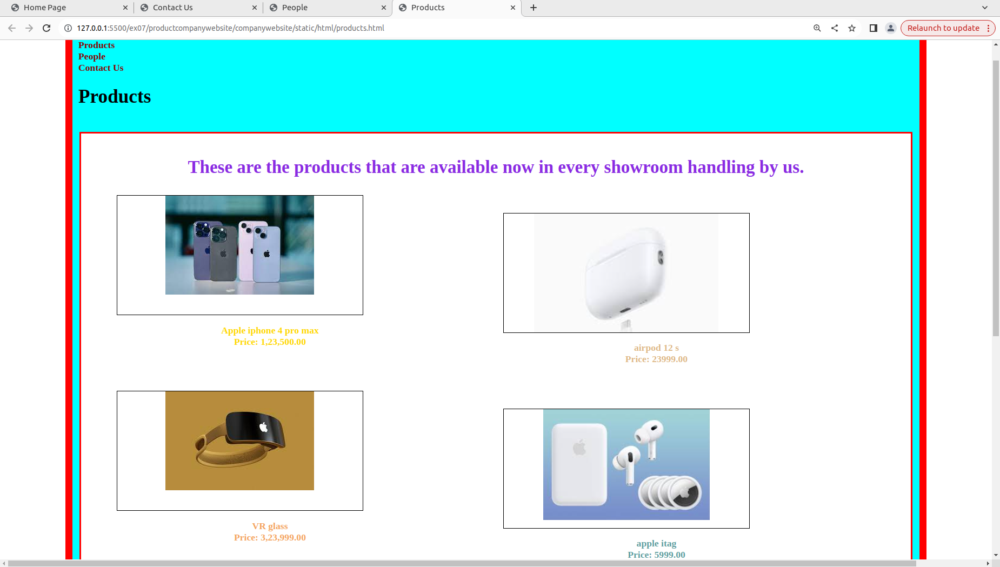
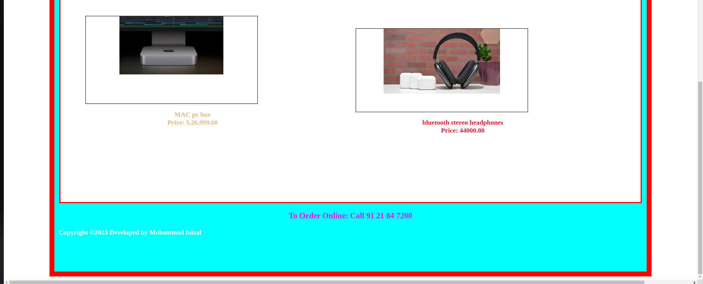
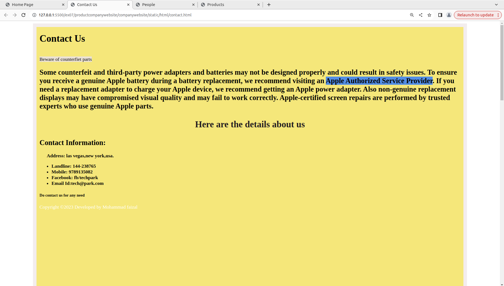
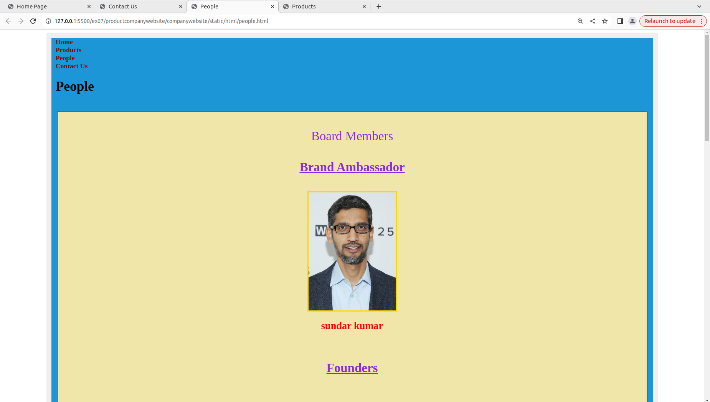
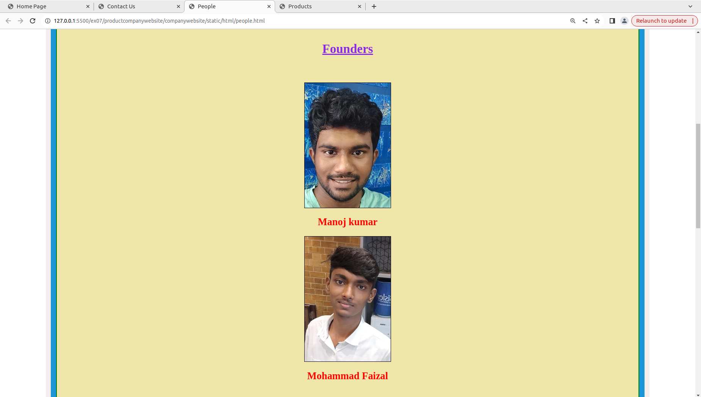
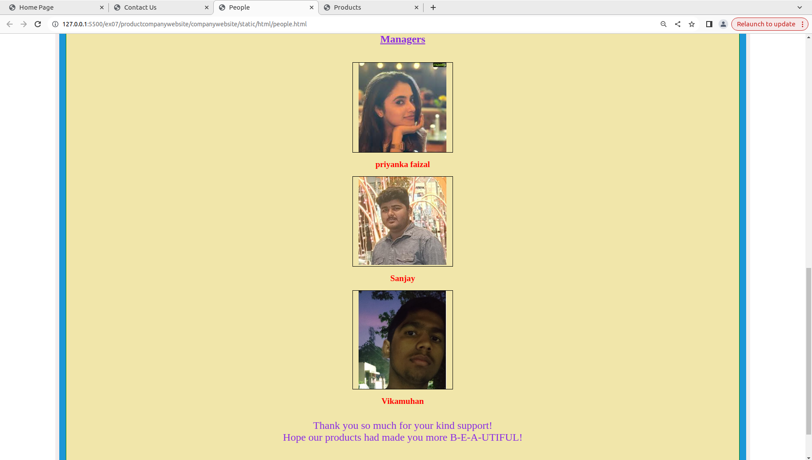

# Web Design for a Software Product Company

## AIM:

To design a static website for a software product company company.

## DESIGN STEPS:

### Step 1:

Requirement collection.

### Step 2:

Creating the layout using HTML and CSS.

### Step 3:

Updating the sample content.

### Step 4:

Choose the appropriate style and color scheme.

### Step 5:

Validate the layout in various browsers.

### Step 6:

Validate the HTML code.

### Step 6:

Publish the website in the given URL.

## PROGRAM :
### home.html
```html
<!DOCTYPE html>
<html lang="en">
    <head>
        <title>
            Home Page
        </title>
        <meta name="viewport" 
         content="width=device-width, initial-scale=1.0">
        <link rel="stylesheet" href="/static/CSS/style.css">
    <style>
        .mypic{
            position: relative;
            top: 151px;
            left: 260px;
            width: 100px;
            height: 100px;
            background-size: cover;
        }
    .text{
        color:black;
        font-family:'Lucida Sans';
        font-size: 30px;
        text-align:center;
    }
    img{
        height: 100px;
        width: 100px;
        align-items:center;
    }
    .home{
            height: 3000px;
            width: 85%;
            border: 12px solid rgb(243, 237, 237);
            padding-left:10px;
            padding-right:10px;
            margin-left: auto;
            margin-right:auto;
            background-color:rgb(28, 150, 215);
        }
      
    </style>

    </head>
    <body>
        <div class="home">
            <div class="header">
                <div class="title">
                </div><br>
                <div class="content">
                    <div class="text">
                    <h1>A2D mobiles and accessories</h1>
                    <p style="color:black; font-family:'Tahoma'; font-size:20px;"> Our own official site for products</p>
                    </div>
                    <p>Original copy of all branded mobiles and accessories<span style="background-color:bisque">A2D mobiles and accessories</span>
                        Instant savings, otherwise referred to as instant cashback, is available with the purchase of an eligible product for qualifying HDFC Bank Credit Cards and EasyEMI Credit Cards only. Minimum transaction value of ₹10001.00 applies. Click here to see instant savings amounts and eligible devices. Instant savings is available for up to two orders per rolling 90-day period with an eligible card. Card eligibility is subject to terms and conditions between you and your card-issuing bank. Total transaction value is calculated after any trade-in credit or eligible discount applied. Any subsequent order adjustment(s) or cancellation(s) may result in instant savings being recalculated, and any refund may be adjusted to account for instant savings clawback; this may result in no refund being made to you. Offer may be revised or withdrawn at any time without any prior notice. Additional terms apply. Offer cannot be combined with Apple Store for Education or Corporate Employee Purchase Plan pricing. Multiple separate orders cannot be combined for instant savings.
                        <span style="background-color:bisque">‡No Cost EMI is available with the purchase of an eligible product made using eligible cards</span> 3- or 6-month tenures from most leading banks. Monthly pricing is rounded to the nearest rupee. Exact pricing will be provided by your bank, subject to your bank’s terms and conditions. Minimum order spend applies as per your card-issuing bank threshold. Offer cannot be combined with Apple Store for Education or Corporate Employee Purchase Plan pricing. Card eligibility is subject to terms and conditions between you and your card-issuing bank. Offer may be revised or withdrawn at any time without any prior notice. Additional terms apply.
                        Representative example: Based on a 6-month tenure.<span style="background-color:bisque">₹79900.00 total cost includes 15% p.a. and No Cost EMI savings of ₹3380.00</span>, paid over 6 months as six monthly payments of ₹13317.00.
                        A subscription is required for Apple TV+.</p>
                    
                    <p><span style="background-color:rgb(169, 208, 227)">Shop and Learn</p>
                    
                        <p><span style="background-color:rgb(169, 208, 227)">Store</p>
                        Mac,
                        iPad,
                        iPhone,
                        Watch,
                        AirPods,
                        TV & Home,
                        AirTag,
                        Accessories,
                        Gift Cards,
                    
                    Apple Wallet,
                    
                        Wallet
                    
                        <p><span style="background-color:rgb(169, 208, 227)">Wallet</p>
                    
                        Manage Your Apple ID
                        Apple Store Account
                        iCloud.com
                    
                        <p><span style="background-color:rgb(169, 208, 227)">Entertainment</p>
                    
                        Apple One
                        Apple TV+
                        Apple Music
                        Apple Arcade
                        Apple Podcasts
                        Apple Books
                        App Store
                    
                        <p><span style="background-color:rgb(169, 208, 227)">Store</p>
                    
                        Find a Store
                        Genius Bar
                        Today at Apple
                        Apple Camp
                        Apple Trade In
                        Ways to Buy
                        Recycling Programme
                        Order Status
                        Shopping Help
                    
                    
                        <p><span style="background-color:rgb(169, 208, 227)">A2D values</p>
                    
                        Accessibility
                        Education
                        Environment
                        Privacy
                        Supplier Responsibility
                    
                        <p><span style="background-color:rgb(169, 208, 227)">About A2D</p>
                    
                        Newsroom<br>
                        Apple Leadership<br>
                        Career Opportunities<br>
                        Investors<br>
                        Ethics & Compliance<br>
                        Events<br>
                        Contact Apple<br>
                    
                    More ways to shop: Find an Apple Store or other retailer near you. Or call 000800 040 1966. </p>
                    <br>
                </div>
                <div class="footer">
                <footer style="color:white">
                Copyright &copy;2023 Developed by Mohammad Faizal</footer></div>
            </div>
        </div>
        
    </body>
</html>

```
### contact.html
```html
<!DOCTYPE html>
<html lang="en">
    <head>
        <title>
            Contact Us
        </title>
        <meta name="viewport" 
         content="width=device-width, initial-scale=1.0">
        <link rel="stylesheet" href="/static/CSS/style.css">
    <style>
    .text{
        color:rgb(35, 27, 32);
        font-family:'Lucida Sans';
        font-size: 30px;
        text-align:center;
    }
    .home{
            height: 3000px;
            width: 85%;
            border: 12px solid rgb(243, 237, 237);
            padding-left:10px;
            padding-right:10px;
            margin-left: auto;
            margin-right:auto;
            background-color:rgb(245, 231, 122);
        }
    
    </style>

    </head>
    <body>
        <div class="home">
            <div class="header">
                
                <div class="title">
                    <h1>Contact Us</h1>
                </div><br>
                <span style="background-color:rgb(235, 226, 212)">Beware of counterfiet parts</span>
                
                    <h2>Some counterfeit and third-party power adapters and batteries may not be designed properly and could result in safety issues. To ensure you receive a genuine Apple battery during a battery replacement, we recommend visiting an <span style="background-color:rgb(83, 142, 229)">Apple Authorized Service Provider</span>. If you need a replacement adapter to charge your Apple device, we recommend getting an Apple power adapter.

                        Also non-genuine replacement displays may have compromised visual quality and may fail to work correctly. Apple-certified screen repairs are performed by trusted experts who use genuine Apple parts.</h2>
                        <div class="content">
                            <div class="text">
                            <p><b>Here are the details about us
                            
                            
                            </div>
                        <b><h2>Contact Information:</h2></b>
                    <p><b>&emsp;&ensp;Address:</b>
                        las vegas,new york,usa.
                    </p>
                    <ul>
                        <li><b>Landline:</b> 144-238765</li>
                        <li><b>Mobile</b>: 9789135082 </li>
                        <li><b>Facebook</b>: fb/techpark </li>
                        <li><b>Email Id:</b>tech@park.com</li>
                    </ul>
                    <h5>Do contact us for any need</h5></b></p>
                    

                </div>
                <div class="footer">
                <footer style="color:white">
                Copyright &copy;2023 Developed by Mohammad faizal</footer></div>
            </div>
        </div>
    </body>
</html>

```
### product.html
```html
<!DOCTYPE html>
<html lang="en">
    <head>
        <title>
            Products
        </title>
        <meta name="viewport" content="width=device-width, initial-scale=1.0">
        <link rel="stylesheet" href="/static/css/styles.css">
        <style>
        .home{
            height: 1555px;
            width: 85%;
            border: 12px solid red;
            padding-left:10px;
            padding-right:10px;
            margin-left: auto;
            margin-right:auto;
            background-color:cyan;
        }
        .text{
            color:blueviolet;
            font-family:'Lucida Sans';
            font-size: 30px;
            text-align:center;
        
        }
        .content{
            border:3px solid red;
            background-color: white;
            width:98%;
            height:1190px;
            padding:10px;
            margin-left:auto;
            margin-right:auto;
        }
        .ph1{
            background-image: url(./images.jpeg);
            background-size: 250px;
            background-position-x: center;
            background-repeat: no-repeat;
            border:1px solid black;
            height:200px;
            width:30%;
            position:relative;
            left: 50px;
        }
        .l1{
            color: gold;
            position:relative;
            right:380px;
          }
        .ph2{
            background-image: url(./images1.jpeg);
            background-size: 250px;
            background-position-x: center;
            background-repeat: no-repeat;
            border:1px solid black;
            height:200px;
            width:30%;
            position:relative;
            left: 50px;
            
        }
        .l2{
            color: sandybrown;
            position:relative;
            right:380px;
        }
        .ph3{
            background-image: url(./images3.jpeg);
            background-size: 250px;
            background-position-x: center;
            background-repeat: no-repeat;
            border:1px solid black;
            height:210px;
            width:30%;
            position:relative;
            left: 50px;
            
        }
        .l3{
            color: burlywood;
            position:relative;
            right:380px;
        }
        .ph4{
            background-image: url(./images4.jpeg);
            background-position-x: center;
            border:1px solid black;
            height:200px;
            width:30%;
            position:relative;
            left: 700px;
            bottom:930px;
            background-size: 310px;
            background-repeat: no-repeat;
          }
        .l4{
            color: burlywood;
            position:relative;
            left:270px;
            bottom: 930px;
        }
    
        .ph5{
            background-image: url(./images5.jpeg);
            background-position-x: center;
            border:1px solid black;
            height:200px;
            width:30%;
            position:relative;
            left: 700px;
            bottom:930px;
            background-size: 280px;
            background-repeat: no-repeat;
            
            
        }
        .l5{
            color: cadetblue;
            position:relative;
            left:270px;
            bottom: 930px;
        }

        .ph6{
            background-image: url(./images7.jpeg);
            background-position-x: center;
            border:1px solid black;
            height:200px;
            width:30%;
            position:relative;
            left: 700px;
            bottom:930px;
            background-size: 280px;
            background-repeat: no-repeat;
            
            
        }
        .l6{
            color: crimson  ;
            position:relative;
            left:270px;
            bottom: 930px;
        }
        .bot{
            text-align:center;
            font-size:larger;
            color:magenta;

        }
      </style>
    </head>
    <body>
        <div class="home">
            <div class="header">
                <header>
                    <div class=logo></div>
                    <div class=h>
                    <a href="home.html" title="Home" style="color: darkred; text-decoration: none;"><b>Home</a></div>
                    <div class="prod">
                        <a href="products.html" title="Products" style="color: darkred; text-decoration: none;"><b>Products</b></a>
                    </div>
                    <div class="people">
                        <a href="people.html" title="People" style="color:darkred; text-decoration: none;"><b>People</b></a>
                    </div>
                    <div class="contact">
                        <a href="contact.html" title="Contact Us" style="color:darkred; text-decoration: none;"><b>Contact Us</b></a>
                    </div>
                </header>
                <div class="title">
                    <h1>Products</h1>
                </div><br>
                <div class="content">
                    <div class="text">
                    <p>These are the products that are available now in every showroom handling by us.</p>
                    </div>
                    <div class="ph1"></div>
                    <div class="l1"><p align="center"><b>Apple iphone 4 pro max<br> Price: 1,23,500.00</b><br><br><br><br></p></div>
                    <div class="ph2"></div>
                    <div class="l2"><p align="center"><b>VR glass<br> Price: 3,23,999.00</b><br><br><br><br></p></div>
                    <div class="ph3"></div>
                    <div class="l3"><p align="center"><b>MAC pc box<br> Price: 5,26,999.00</b><br<br><br><br></p></div>
                    <div class="ph4"></div>
                    <div class="l4"><p align="center"><b>airpod 12 s<br> Price: 23999.00</b><br><br><br><br></p></div>
                    <div class="ph5"></div>
                    <div class="l5"><p align="center"><b>apple itag<br> Price: 5999.00</b><br><br><br><br></p></div>
                    <div class="ph6"></div>
                    <div class="l6"><p align="center"><b>bluetooth stereo headphones<br> Price: 44000.00</b><br><br><br><br></p></div>
         
                </div>
                <div class="bot"><p>To Order Online: Call 91 21 84 7200</p></div>

                <div class="footer">
                <footer style="color:white">
                Copyright &copy;2023 Developed by Mohammad faizal</footer></div>
            </div>
        </div>
    </body>
</html>

```
### people.html
```html 
<!DOCTYPE html>
<html lang="en">
    <head>
        <title>
            People
        </title>
        <meta name="viewport" content="width=device-width, initial-scale=1.0">
        <link rel="stylesheet" href="/static/css/styles.css">
        <style>
        .home{
            height: 3000px;
            width: 85%;
            border: 12px solid rgb(243, 237, 237);
            padding-left:10px;
            padding-right:10px;
            margin-left: auto;
            margin-right:auto;
            background-color:rgb(28, 150, 215);
        }
        .text{
        color:blueviolet;
        font-family:'Lucida Sans';
        font-size: 30px;
        text-align:center;
        
        }
        .content{
            border:2px solid green;
            background-color:rgb(241, 230, 170);
            width:98%;
            height:2690px;
            padding:10px;
            margin-left:auto;
            margin-right:auto;
        }
        .ceoph{
            background-image: url(./suna.png);
            background-size: 250px;
            background-position-x: center;
            background-repeat: no-repeat;
            border:3px solid gold;
            height:280px;
            width:15%;
            position:relative;
            left: 0px;
            margin-left:auto;
            margin-right: auto;
        }
        .ceo{
            color: red;
            position:relative;
            text-align:center;
        }
        .manph1{
            background-image: url(./kumar.jpeg);
            background-size: 250px;
            background-position-x: center;
            background-repeat: no-repeat;
            border:1px solid black;
            height:300px;
            width:15%;
            position:relative;
            margin-left:auto;
            margin-right:auto;            
        }
        .man1{
            color: red;
            position:relative;
            text-align:center;
            
        }
        .manph2{
            background-image: url(./f1.jpeg);
            background-size: 250px;
            background-position-x: center;
            background-repeat: no-repeat;
            border:1px solid black;
            height:300px;
            width:15%;
            position:relative;
            margin-left:auto;
            margin-right:auto;

            
        }
        .man2{
            color: red;
            position:relative;
            text-align:center;
        }
        
        .amph1{
            background-image: url(./pm.jpeg);
            background-size: 250px;
            background-position-x: center;
            background-repeat: no-repeat;
            border:1px solid black;
            height:255px;
            width:15%;
            position:relative;
            margin-left:auto;
            margin-right:auto;

            
        }
        .am1{
            color: red;
            position:relative;
            text-align:center;
        }

.amph2{
    background-image: url(./s.png);
    background-size: 250px;
    background-position-x: center;
    background-repeat: no-repeat;
    border:1px solid black;
    height:255px;
    width:15%;
    position:relative;
    margin-left:auto;
    margin-right:auto;

    
}
.am2{
    color: red;
    position:relative;
    text-align:center;
}
.amph3{
    background-image: url(./v2.png);
    background-size: 250px;
    background-position-x: center;
    background-repeat: no-repeat;
    border:1px solid black;
    height:280px;
    width:15%;
    position:relative;
    margin-left:auto;
    margin-right:auto;

    
}
.am3{
    color: red;
    position:relative;
    text-align:center;
}
</style>
</head>
<body>
<div class="home">
    <div class="header">
        <header>
            <div class=logo></div>
            <div class=h>
            <a href="home.html" title="Home" style="color: darkred; text-decoration: none;"><b>Home</b></a></div>
            <div class="prod">
                <a href="products.html" title="Products" style="color: darkred; text-decoration: none;"><b>Products</b></a>
            </div>
            <div class="people">
                <a href="people.html" title="People" style="color:darkred; text-decoration: none;"><b>People</b></a>
            </div>
            <div class="contact">
                <a href="contact.html" title="Contact Us" style="color:darkred; text-decoration: none;"><b>Contact Us</b></a>
            </div>
        </header>
        <div class="title">
            <h1>People</h1>
        </div><br>
        <div class="content">
            <div class="text">
            <p>Board Members</p>
            <p></p>
            <h4><u>Brand Ambassador</u></h4>
            </div>
            <div class="ceoph"></div>
            <div class="ceo"><p align="center"><b><h2>sundar kumar</h2></b></div>
            <br>
            <div class="text">
                <p><b><u>Founders</u></b></p><br>
            </div>
            <div class="manph1"></div>
            <div class="man1"><p align="center"><b><h2>Manoj kumar</h2></b></p></div>
            <div class="manph2"></div>
            <div class="man2"><p><b><h2>Mohammad Faizal</h2></b></p></div>
            <br>
            <div class="text"><p><b><u>Managers</u></b></p></div><br>
            <div class="amph1"></div>
            <div class="am1"><p align="center"><b><h2>priyanka faizal</h2></b></p></div>
            <div class="amph2"></div>
            <div class="am2"><p align="center"><b><h2>Sanjay</h2></b></p></div>
            <div class="amph3"></div>
            <div class="am3"><p align="center"><b><h2>Vikamuhan </h2></b></p></div><br>
            <div class="text">Thank you so much for your kind support!<br>Hope our products had made you more B-E-A-UTIFUL!</div>
        </div>
        <div class="footer">
        <footer style="color:white">
        Copyright &copy;2023 Developed by Mohammad faizal</footer></div>
    </div>
</div>
</body>
</html>

```

## OUTPUT:

### Home Page:


### Product Page:



### contact Page:


### People page:





## Result:

Thus a website is designed for the software product company and the HTML,CSS code are validated.
